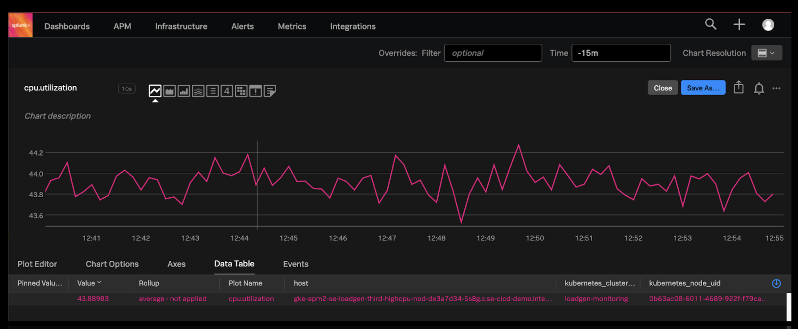
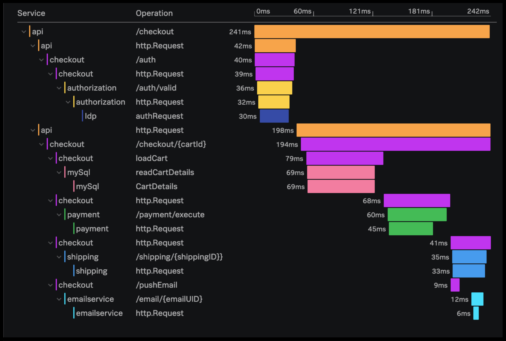
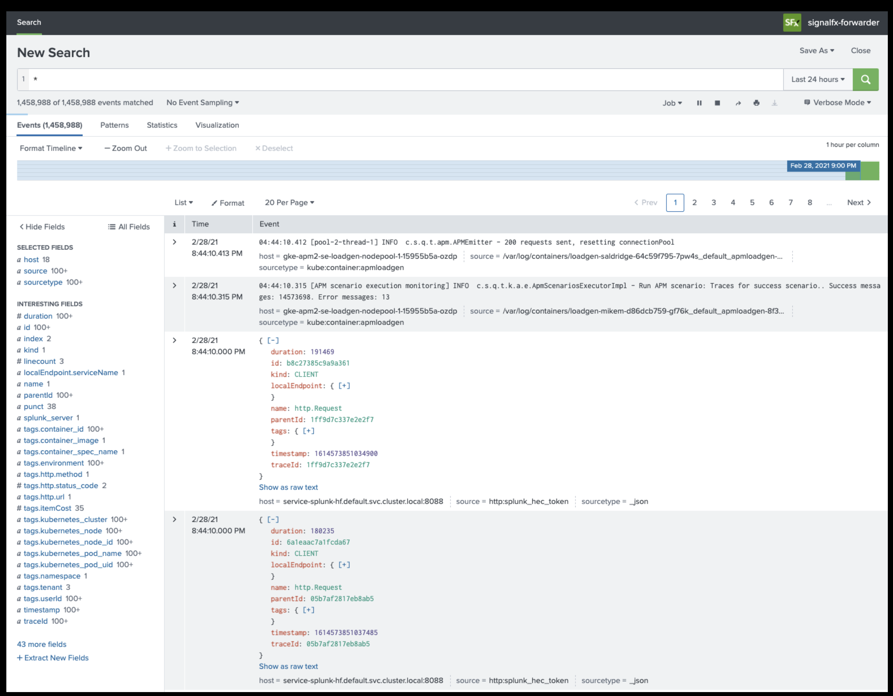

# Concepts

## Metrics, Traces and Logs
|&nbsp;|Metrics|Traces|Logs|
|--|--|--|--|
|**Concept**|Measurable number that varies over time|Comprised of *spans* of time spent in application code|Record of event that happened|
|**Examples**|CPU Utilization Service Latency Error Rate|Milliseconds spent in a microservices framework|Http Requests Exceptions|
|**Format**|Timeseries Data|Span Data|Event Data|

## Metrics

Metrics are a set of numbers that provide information about a particular process or activity. They enable a longer retention of data, and make it easier to query. They are fast to alert on.

## Traces

Traces represent a fulfillment of a single request as it touches multiple components in a system. Each trace contains a number of spans and span metadata. Spans can be auto-instrumented or instrumented manually. Each span has its own ID as well as an ID of it's parent, which is used to reconstruct the trace.

## Logs

Logs are distinct records of "what happened". They are easy to generate, and are found across applications and their supporting infrastructure (kubernetes, operating system, etc.). It may frequently have the final source of a particular issue.

