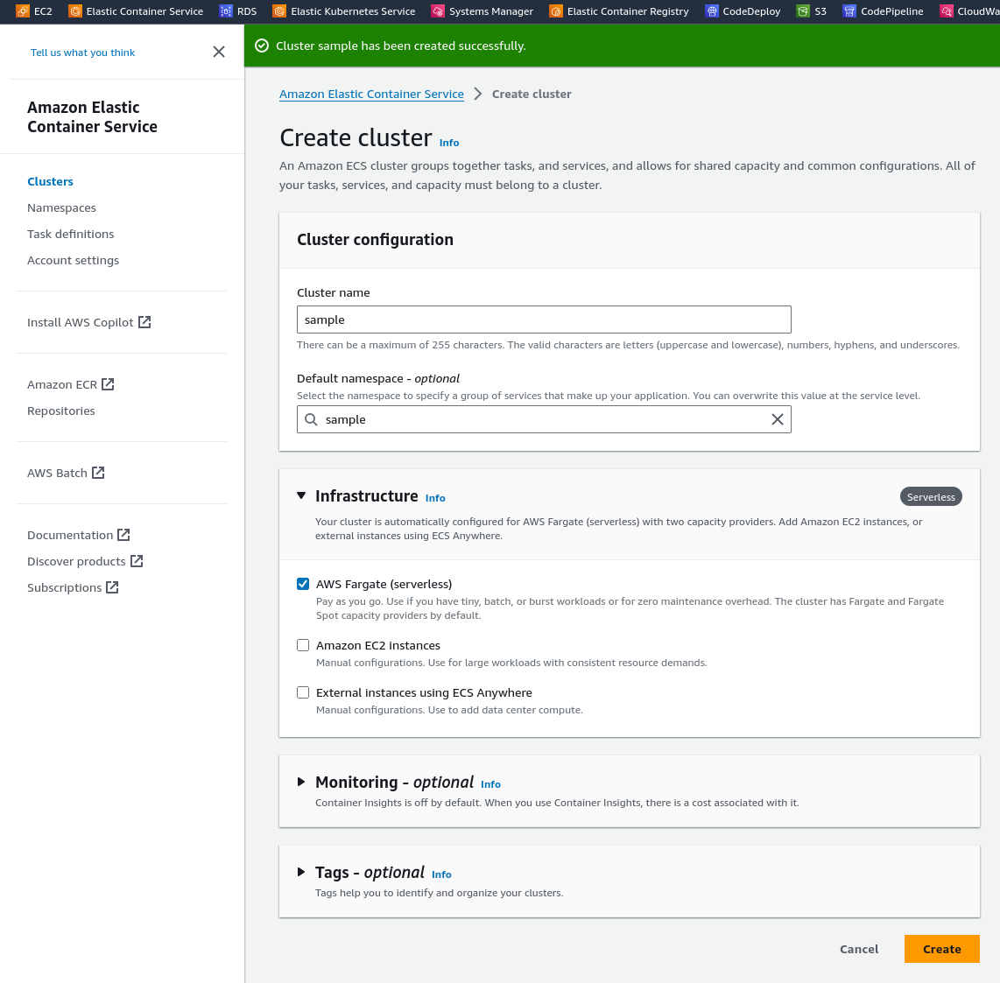

# ECS Fargate Example

In this example we will look at deploying an ECS Fargate (serverless) service.

A documentation example is found [here](https://docs.splunk.com/observability/en/gdi/opentelemetry/deployments/deployments-fargate-java.html). We will use those instructions with our simple Java app.

## Prerequisites
You will need the following to run this example:
- docker
- A docker hub account
- An AWS account

## Setup
* In AWS, first create a cluster



* Next let's create the application war
```
cd app

```
