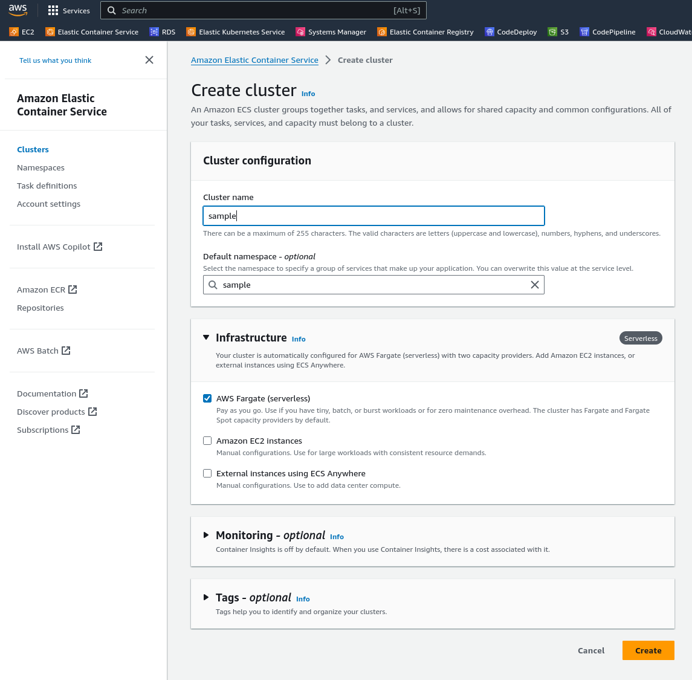

# ECS Fargate Example

In this example we will look at deploying an ECS Fargate (serverless) service.

A documentation example is found [here](https://docs.splunk.com/observability/en/gdi/opentelemetry/deployments/deployments-fargate-java.html). We will use those instructions with our simple Java app.

NOTE: This example, like the others, is meant to demonstrate what's possible and does not serve as a recommendation for configuring AWS services. (A specific point is this service is accessed directly vs. through a load balancer.)

## Prerequisites
You will need the following to run this example:
- docker
- A docker hub account
- An AWS account

## Setup
* First let's setup the **log group**
  * In AWS Service Search, find `Cloudwatch` and navigate to it
  * select `Logs` > `Log Groups`, and create a new log group for `/ecs/agent-baked-in-example`
* Next, let's find the **ECS task execution ARN**
  * In AWS Service Search, find `IAM` and navigate to it
  * Click `Roles`
  * Search for `ecsTaskExecutionRole` and select it
  * Copy the ARN (for example `arn:aws:iam::576812345678:role/ecsTaskExecutionRole`) 
* Locally, let's build and publish the application war to docker hub
  * Replace `USERNAME` with your docker hub username

```
cd app
docker build --platform="linux/amd64" -t tomcat-with-splunk-java-agent:latest --no-cache .
docker tag tomcat-with-splunk-java-agent:latest USERNAME/tomcat-with-splunk-java-agent:latest
docker push USERNAME/tomcat-with-splunk-java-agent:latest
```

* Now let's do the steps in `Elastic Container Service`
  * In AWS Service Search, find `Elastic Container Service` and navigate to it
  * Create a cluster




  * Click `Task Definitions`, then `Create a task definition from json`, replacing the following in the json below
    * `image`: Replace your `USERNAME`
    * `executionRoleArn`: Your ECS task execution role
    * `SPLUNK_REALM`: Your realm
    * `SPLUNK_ACCESS_TOKEN`: Ingest token
    * `awslogs-region`: AWS region (2 places)

```json
{
  "family": "agent-baked-in-example",
  "containerDefinitions": [
      {
          "name": "tomcat",
          "image": "USERNAME/tomcat-with-splunk-java-agent:latest",
          "cpu": 0,
          "portMappings": [
              {
                  "name": "tomcat-8080-tcp",
                  "containerPort": 8080,
                  "protocol": "tcp",
                  "appProtocol": "http"
              }
        ],
          "essential": true,
          "environment": [
              {
                  "name": "OTEL_SERVICE_NAME",
                  "value": "myservice"
              },
              {
                  "name": "OTEL_RESOURCE_ATTRIBUTES",
                  "value": "deployment.environment=test,service.version=1.0"
              },
              {
                  "name": "JAVA_TOOL_OPTIONS",
                  "value": "-javaagent:/opt/splunk/splunk-otel-javaagent.jar"
              }
          ],
          "environmentFiles": [],
          "mountPoints": [],
          "volumesFrom": [],
          "dependsOn": [],
          "ulimits": [],
          "logConfiguration": {
              "logDriver": "awslogs",
              "options": {
                  "awslogs-create-group": "true",
                  "awslogs-group": "/ecs/agent-baked-in-example",
                  "awslogs-region": "us-east-2",
                  "awslogs-stream-prefix": "ecs"
              },
              "secretOptions": []
          }
      },
      {
          "name": "splunk-otel-collector",
          "image": "quay.io/signalfx/splunk-otel-collector:latest",
          "cpu": 0,
          "portMappings": [],
          "essential": true,
          "environment": [
              {
                  "name": "SPLUNK_CONFIG",
                  "value": "/etc/otel/collector/fargate_config.yaml"
              },
              {
                  "name": "SPLUNK_REALM",
                  "value": "<Realm - us0, us1, etc>"
              },
              {
                  "name": "SPLUNK_ACCESS_TOKEN",
                  "value": "<Access Token>"
              },
              {
                  "name": "ECS_METADATA_EXCLUDED_IMAGES",
                  "value": "[\"quay.io/signalfx/splunk-otel-collector:latest\"]"
              }
          ],
          "environmentFiles": [],
          "mountPoints": [],
          "volumesFrom": [],
          "logConfiguration": {
              "logDriver": "awslogs",
              "options": {
                  "awslogs-create-group": "true",
                  "awslogs-group": "/ecs/agent-baked-in-example",
                  "awslogs-region": "us-east-2",
                  "awslogs-stream-prefix": "ecs"
              },
              "secretOptions": []
          }
      }
  ],
  "executionRoleArn": "arn:aws:iam::576812345678:role/ecsTaskExecutionRole",
  "networkMode": "awsvpc",
  "requiresCompatibilities": [
      "FARGATE"
  ],
  "cpu": "1024",
  "memory": "3072",
  "runtimePlatform": {
      "cpuArchitecture": "X86_64",
      "operatingSystemFamily": "LINUX"
  }
}
```

  * Switch to `clusters`, click on the `sample` cluster, and create a new service
    * `Family` = `agent-baked-in-example`
    * `Service Name` = `myservice`
    * and click `Create`


This should be all you need to do. If you have any issues you may need to review the security group for your service. Inbound we need port 8080 open, and outbound we opened http (80) and https (443) to pull containers.

Finally you can find the public URLs for each task. navigating to `http://<public ip>:8080` will show you the application and create traces.