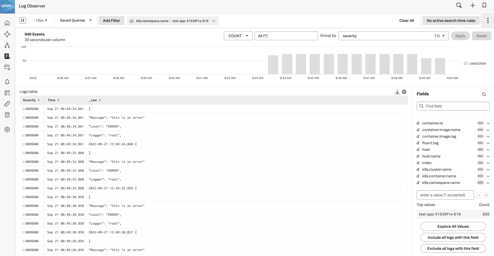

# Kubernetes Multiline example

This example will walk through configuring Kubernetes logging (fluentd, can be expanded to otel in the future) to Splunk Observability Cloud Log Observer, and deploying a sample app that emits multiline logs to be processed.

## Pre-requisites

This example assumes you have k3s installed. If you have that deployed you can skip to the next section.

To simplify creating the environment I am using the terraform provided [here](https://github.com/signalfx/observability-workshop/tree/master/workshop/aws/ec2) and running (after initialization and setting up environment variables):
```
terraform apply \
-auto-approve \
-var="aws_region=us-east-2" \
-var="aws_instance_type=t2.small" \
-var="aws_instance_count=1" \
-var="slug=multiline"
```

And then you can access the instance by running:
```
ssh ubuntu@<ip address>
```
If you get a permission error then just wait a few more seconds for the cloud-init script to finish. The password can be found [here](https://github.com/signalfx/observability-workshop/blob/master/workshop/cloud-init/k3s.yaml#L3).

Once in the shell edit the `~/.profile` file and remove the section on `helm() {}`. Then logout and back in to refresh your session. 

## Installing and Deploying Acorn

This example is using acorn, which is a new application packaging and deployment framework for running apps in kubernetes.

This is not required, you could instead either:
* Build the image and load it into k3s
* Build and tag the image, and reference the image in k3s

To install Acorn:
* Install Acorn CLI (or use [brew method](https://docs.acorn.io/installation/installing))
```
curl https://get.acorn.io | sh
```
* Deploy Acorn into k3s
```
acorn install
```

## Deploy OTel Collector

Follow the steps you do to deploy the OTel Collector using helm. Be sure to select that you want to collect logs.

(If you get an issue about "ACCESS_TOKEN is unset" see notes above about modifying the `.profile`)

## Verify installation
Check in Splunk Observability Cloud that you see logs flowing for your instance. You should be able to filter on your `k8s.cluster.name`, `k8s.node.name`, etc.

## Deploy the application
Now that we have all the infrastructure setup with the OTel Collector deployed let's attempt to send some multi-line logs.

```
cd test-app
acorn run -n test-app .
```

## Find the logs in Splunk Observability Cloud
Acorn deploys each app in it's own namespace, so you can find this output there:


We can see that each line is brought in as a single entry.

## Configure OTel Collector for multi-line
In the directory review the `values.yml` file. It is configured for pods named `app` and will look for the date starting the beginning of each new line.
```
from:
  container: app
multiline:
  firstline: /^[0-9]{4}-[0-9]{2}-[0-9]{2}.*/
```

To use this new config, but retain the rest of the config already set:
```
helm list
<get release, update numbers below>

helm upgrade --reuse-values -f values.yml splunk-otel-collector-########## splunk-otel-collector-chart/splunk-otel-collector
```

## Review the logs again in Splunk Observability Cloud
Now you will see the multiline log entries are brought together


You will still want to do some additional work (like map the `Level` to `Severity`) but that is not the point of this example

## Cleanup (if you used terraform above)

To remove the AWS EC2 instance:
```
terraform apply -destroy \
-auto-approve \
-var="aws_region=us-east-2" \
-var="aws_instance_type=t2.small" \
-var="aws_instance_count=1"
-var="slug=multiline"
```