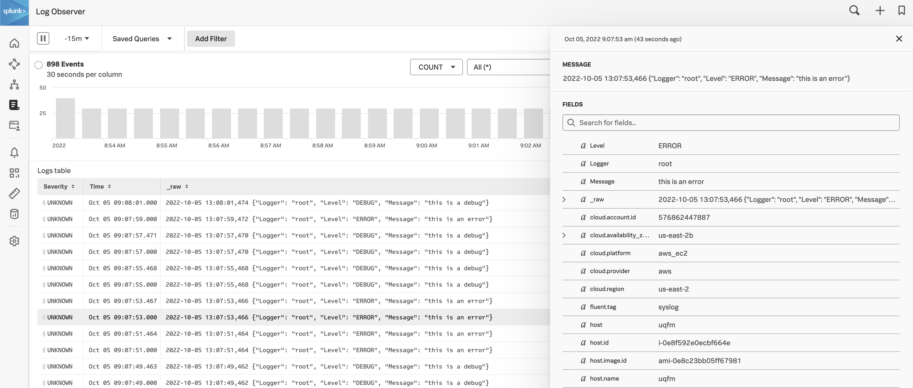
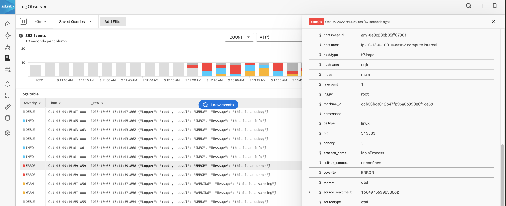

# Log Observer Severity Examples

This example will walk through several scenarios of setting severities and how you can get them to show up in Splunk Log Observer

## Pre-requisites

* A machine running an OTel Collector connected to Splunk Log Observer directly
  * Tested on Linux
* Python 3

## General situation

In python we are sending in json logs. Here is an example from one of the scenarios:

### Setup Code
```
python3 -m venv venv
source venv/bin/activate
pip3 install -r requirements.txt
python3 app.py
```

### Sample Log Entry:
```
root.error('this is an error')
```

### Resulting _raw data:
```
2022-10-05 13:05:53,354 {"Logger": "root", "Level": "INFO", "Message": "this is an info"}
```

These logs are parsed on ingest using a pre-packaged rule (Json Map Parser). However we will explore a few different scenarios on how to set the severity properly.

## Use Case 1: Sending in as a different field

In the example above the log entries aren't sent with `severity` set properly. This results in something like this in Log Observer:



To map these `Level` fields as `severity` we can add a processing rule:
* Go to **Settings** > **Pipeline Management**
* Click **New Processing Rule**
* Select **Field Copy** and **Next**
* Set it to `Level` Copies to `severity`
* Click **Next** a few times and **Save**

New log entries will now be mapped correctly:



## Use Case 2: Sending in as severity, but not using the expected values

Suppose your logs were using Python's [Logging Levels](https://docs.python.org/3/library/logging.html#logging-levels):
| Level | Numeric Value |
|---|---|
|CRITICAL|50|
|ERROR|40|
|WARNING|30|
|INFO|20|
|DEBUG|10|


In this example your logs might look like the following
```
2022-10-05 13:05:53,354 {"Logger": "root", "severity": "10", "Message": "this is a debug"}
2022-10-05 13:07:53,354 {"Logger": "root", "severity": "20", "Message": "this is an info"}
2022-10-05 13:12:53,354 {"Logger": "root", "severity": "30", "Message": "this is a warn"}
```

The scenario would be the same if any other custom values were used (i.e. ERRONEOUS)

(To be continued...)