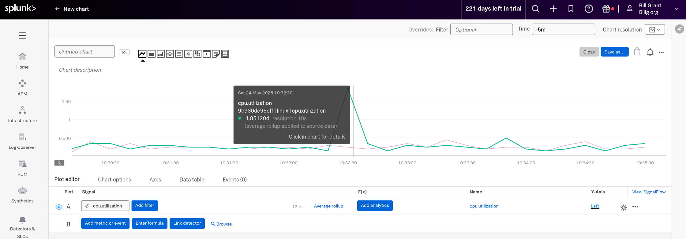

## Docker Swarm example

This document explains how to setup a docker swarm environment, that we will deploy the OTel collector in.

Based on [this article](https://dev.to/mattdark/docker-swarm-with-virtual-machines-using-multipass-39b0) for setting up swarm with multipass.

### Setup

Run the following from the host to deploy the 3 systems with docker

```bash
sh -x init_instance.sh manager
sh -x init_instance.sh worker1
sh -x init_instance.sh worker2
```

Then initialize the swarm:

```bash
multipass exec manager -- docker swarm init
```
and take the token shared and then connect the workers:

```bash
multipass exec worker1 -- docker swarm join --token [token] [ip]:2377
multipass exec worker2 -- docker swarm join --token [token] [ip]:2377
```

Confirm the swarm:
```bash
multipass exec manager -- docker node ls
```

### OTel deployment

Now we want to deploy the Open Telemetry collector

```bash
multipass transfer docker-compose_manager.yml manager:/home/ubuntu/docker-compose.yml
multipass exec manager -- docker stack deploy --compose-file docker-compose.yml otelcol
```

And to confirm it is up:

```bash
multipass exec manager -- docker stack services otelcol
```

It is up when it says 1/1.

Now you have it deployed to the manager, let's update it to only deploy to the workers:

```bash
multipass transfer docker-compose_workers.yml manager:/home/ubuntu/docker-compose.yml
multipass exec manager -- docker stack deploy --compose-file docker-compose.yml otelcol
```

Now when you run:
```bash
multipass exec manager -- docker stack services otelcol
```

you will know it is deployed when it reaches 2/2.

### Add OTel Config

Let's add an otel config. We will need to place this configuration file on each of the workers so it will be used. (We will also add it to the manager, but since we are only running the collector from the workers this isn't strictly necessary.)

```bash
# Undeploy
multipass exec manager -- docker stack rm otelcol
# Push the compose file and the config file
multipass transfer docker-compose_config.yml manager:/home/ubuntu/docker-compose.yml
multipass transfer config1.yml manager:/home/ubuntu/collector.yml
multipass transfer config1.yml worker1:/home/ubuntu/collector.yml
multipass transfer config1.yml worker2:/home/ubuntu/collector.yml
# Deploy
multipass exec manager -- docker stack deploy --compose-file docker-compose.yml otelcol
# Verify
multipass exec manager -- docker stack services otelcol
```

You can shell into each of the instances and do the regular investigations what's happening:

```bash
# Go onto the worker
multipass shell worker1
# View running containers
docker ps -a
# View logs of otel collector
docker logs [Container ID]
# Exit back to your host
exit
```

Here's an example of the `cpu.utilization` metric being sent:
